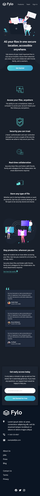

# Frontend Mentor - Fylo dark theme landing page solution

This is a solution to the [Fylo dark theme landing page challenge on Frontend Mentor](https://www.frontendmentor.io/challenges/fylo-dark-theme-landing-page-5ca5f2d21e82137ec91a50fd). Frontend Mentor challenges help you improve your coding skills by building realistic projects. 


## Table of contents

- [Overview](#overview)
  - [The challenge](#the-challenge)
  - [Screenshot](#screenshot)
  - [Links](#links)
- [My process](#my-process)
  - [Built with](#built-with)
  - [What I learned](#what-i-learned)
  - [Continued development](#continued-development)
- [Author](#author)
- [Acknowledgments](#acknowledgments)

## Overview

### The challenge

Users should be able to:

- View the optimal layout for the site depending on their device's screen sizeCancel changes
- See hover states for all interactive elements on the page

### Screenshot




### Links

[Live site with Netlify](https://fylo-dark-landing-page-kas.netlify.app)

## My process

### Built with

- Semantic HTML5 markup
- Flexbox
- Mobile-first workflow
- Sass
- Parcel
- Netlify

### What I learned

I had my eye on a couple of tools I would've liked to try since a while. My goal here was to choose a challenge that allows me to focus on these new skills rather than worrying about the layout and such. But as most Frontend Mentor challenges, this one had its quirks. But in the end I thorougly enjoyed myself. So let's see what I learned:

**Sass**

I'm in love with CSS since I first changed the background color to red in my first plain HTML website and Sass just takes it to the next level. I would lie if I said I managed to try everything I wanted but I believe this project is a good a start.

*Partials, modules*

One big pain with CSS is how long it tends to get. In this challenge I modularized everything, one Sass file to each section, one for variables, one for buttons, etc. Suddenly it became much easier to find what I wanted.

*Nesting*

I loved this. How many times I had to scroll all the way down to find my media queries and then back because I already forget what was the padding or font-size that I wanted to change. In this projects I felt like I nested all media queries where they're actually relevant like this:

```
.reviews-holder {
  display: flex;
  flex-direction: column;
  gap: 1.6rem;
  padding-inline: 3rem;
  position: relative;
  margin: 0 auto;
  max-width: 450px;

  @media (min-width: 1000px) {
    flex-direction: row;
    gap: 2.5rem;
    padding-block-start: 9rem;
    max-width: 1250px;
  }
}
```

Vanilla CSS keeps getting better every day with custom variables and so on but these two things I mentioned above I particularly enjoyed about Sass.

**Parcel**

So far I was uploading my vanilla CSS and JS straight to Github without thinking much. This was the first time I tried having a separate development environment and build. Parcel was really straightforward to use, I loved that it generated a live server and warned me of the the errors I made straight away. I'm sure there's more to it, so far I'm just very happy everything worked out so well.

**Netlify**

Having separate dev/build came with its own problems. Do I need to upload Sass files to Github or only the generated CSS is going to be used? What if I wanted to make updates to my Sass? Do I need to run the build script every time I change a font-size? I was trying to wrap my head around these things since a long time and frankly kept me from using Parcel altogether. Netlify was my solution, as it handles the build for me and deployed it as well. Again, there must be more to it, but even this was very impressive. And very easy to use!

*And finally one of those Frontend Mentor challenge quirks:*

**Navbar links - changing font-weight on hover**

Navbar links have a font-weight of 400 and they change to 700 as you hover over them. Sounds easy, but this one gave me a real headache as the whole menu kept jumping around as the changed font-weight required some extra space. Not a big issue I suppose, but it hurt my eyes. Here's the solution I used: 

```
.menu-link::before {
  display: block;
  content: attr(title);
  font-weight: bold;
  height: 0;
  overflow: hidden;
  visibility: hidden;
}
```

Not the most elegant solution perhaps but the one I found the most reliable. Hopefully I'll never have to change font-weight in navbar links again but if I do, I'll probably come back to this. 

### Continued development

This project made me realise that there's so much about Flexbox I still don't know. I'll spend more time filling in those gaps (pun unintended) in my knowledge in the near future!
I definitely need to experiment more with the tools I just used to build the project. I'm sure there are plenty of possibilities that I haven't covered here.

## Author

- Frontend Mentor - [@FluffyKas](https://www.frontendmentor.io/profile/FluffyKas)

## Acknowledgments

Frontend's Slack Group:
I'd like to thank Ameus Namite from Frontend Mentor's Slack for patiently answering my questions about Netlify.
Big thanks also to Alex Kim for clearing up my misconceptions about crossbrowser support!

Thank YOU, if you were so kind to take the time and have a read through of this README. :purple_heart:
